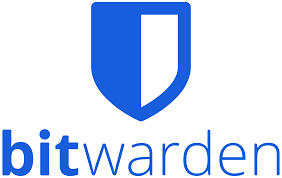

# Health: Wearables

## Apple Watch

::::: {style="display: flex;"}
:::: {.column1}

- Activity Ring
- Notification prioritization

::::

:::: {.column2}

::::
:::::

## Oura Ring

::::: {style="display: flex;"}
:::: {.column1}

- Sleep tracking
- Blood oxygen level

::::

:::: {.column2}

::::
:::::

# Health: App

## Sleep Trackers

::::: {style="display: flex;"}
:::: {.column1}

-   Health App
-   Oura App

::::

:::: {.column2}

::::
:::::

## Activity

::::: {style="display: flex;"}
:::: {.column1}

-   Strava
-   All Trails

::::

:::: {.column2}

::::
:::::

# Productivity: Compute

## Mac Mini

::::: {style="display: flex;"}
:::: {.column1}

-   Cheap for what it is

::::

:::: {.column2}

::::
:::::

## Raspberry Pi

::::: {style="display: flex;"}
:::: {.column1}

-   Terminal life

::::

:::: {.column2}

::::
:::::

## Cantor Keyboard

::::: {style="display: flex;"}
:::: {.column1}

-   Ergonomic
-   Compact
-   Fun
-   36k forks and 16k stars on Github

::::

:::: {.column2}

::::
:::::

## Supernote Nomad

::::: {style="display: flex;"}
:::: {.column1}

-   Thoughts
-   Meetings
-   ebook reader
-   Hiking

::::

:::: {.column2}

::::
:::::

# Productivity: Apps

## GitHub

::::: {style="display: flex;"}
:::: {.column1}

-   Permanent Content
-   Personal Website
-   Keyboard Config
-   Dotfiles
-   Starred Repos

::::

:::: {.column2}

::::
:::::

## Things3

::::: {style="display: flex;"}
:::: {.column1}

-   Transient Content / Todo
-   Transition from webapps
-   ...to BearNotes
-   ...to Notion
-   ...to Obsidian

::::

:::: {.column2}

::::
:::::

## Bitwarden

::::: {style="display: flex;"}
:::: {.column1}

-   Password Management
-   Cross-platform
-   Cloud-synced
-   MFA-based

::::

:::: {.column2}

::::
:::::
