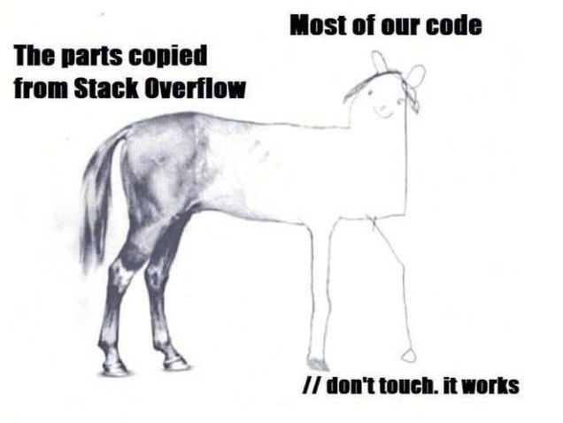
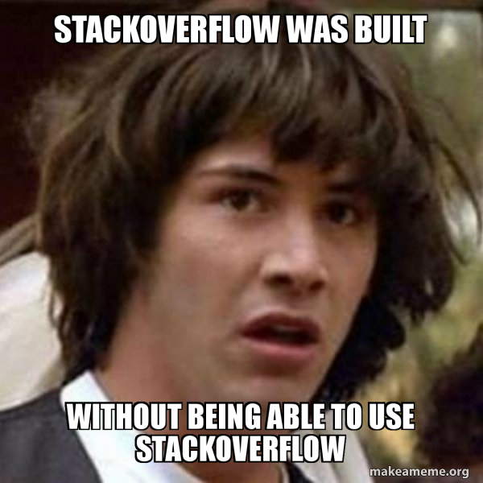

# Programming vs other professions

    highlight: pygments
    center: true

## Entrepreneur / chess player

{ width=50\% }

# Programmer Value: Sharing

## Sharing ideas

{ width=50\% }

# Programmer Value: Open source

## The altruism

## What can be achieved!

# Programmer Paradise: Stackoverflow

## The necessity

## But how

## ...because

